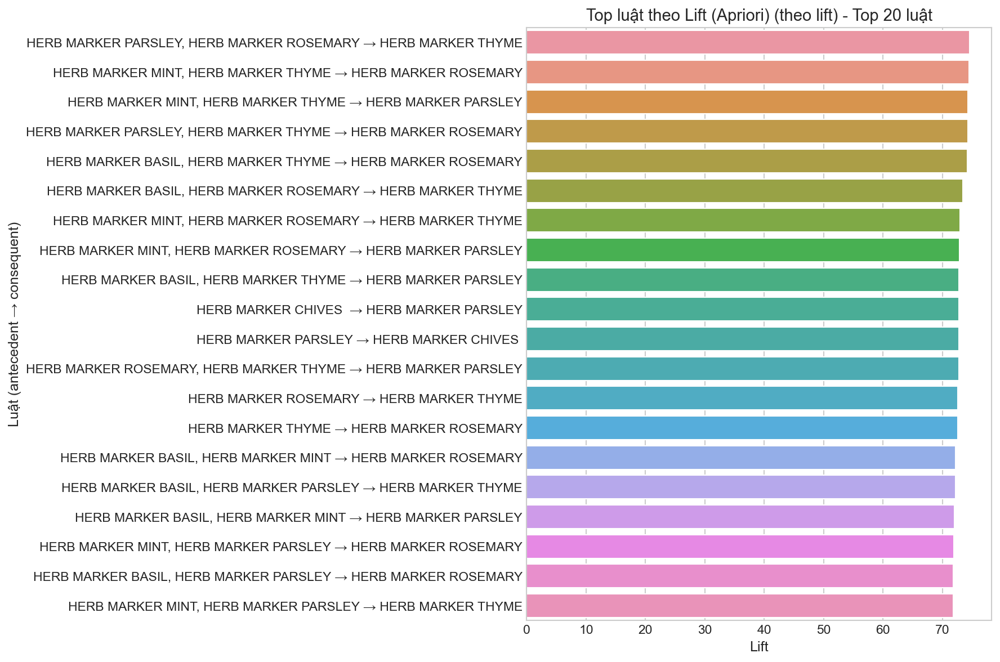
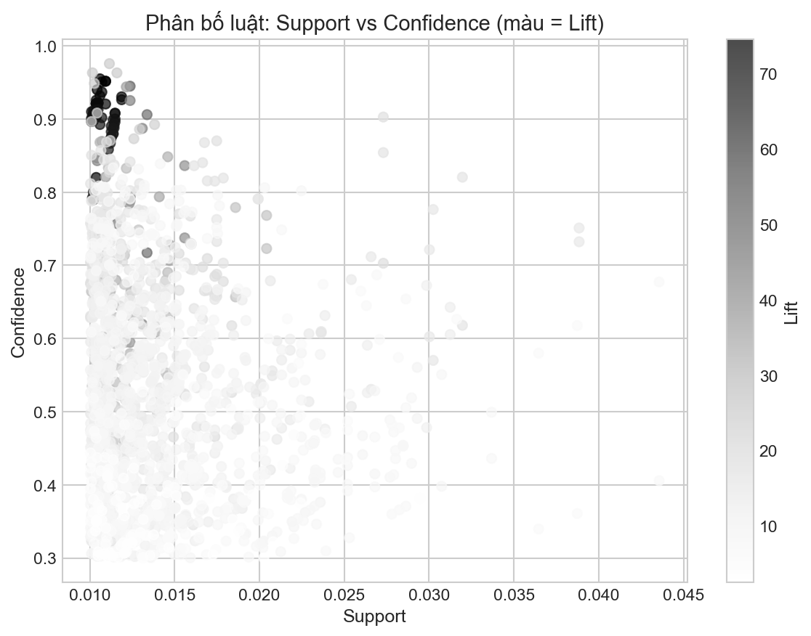
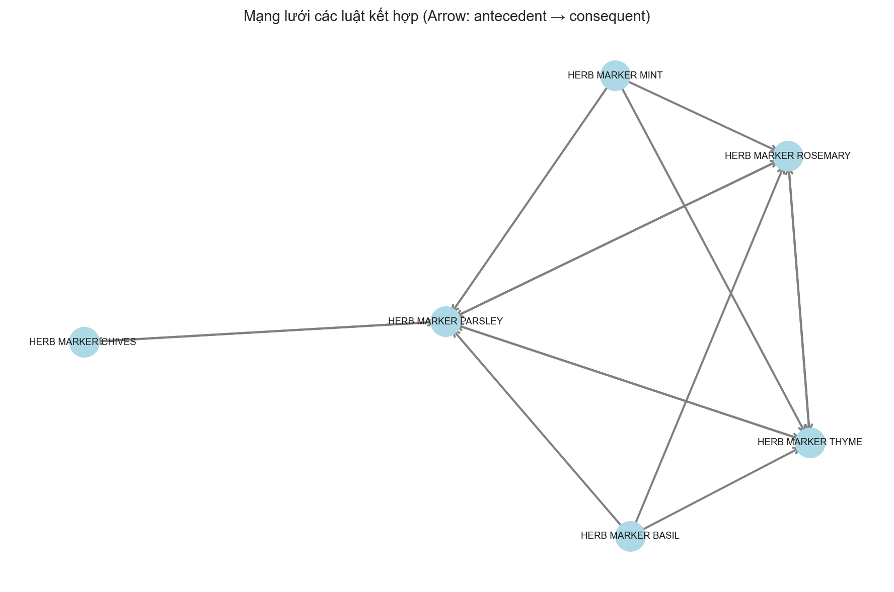

# Trực quan hoá kết quả Apriori

Thời điểm chạy: `20251212_183515`

Các biểu đồ được lưu tự động tại:

- `reports/plots_20251212_183515`

## 1. Bar chart: Top luật theo Lift

**Diễn giải ý nghĩa**

- Lift đo mức độ mối quan hệ mạnh hơn ngẫu nhiên giữa vế trái và vế phải của luật.
- Bar chart này giúp chọn các luật có lift cao để ưu tiên cho gợi ý mua kèm / combo / trưng bày gần nhau.
- Khi đọc biểu đồ, nên kiểm tra thêm support để tránh chọn luật quá hiếm (khó áp dụng rộng).

## 2. Scatter plot: Support vs Confidence (màu = Lift)

**Diễn giải ý nghĩa**

- Support cho biết luật xuất hiện thường xuyên đến mức nào trong toàn bộ hoá đơn (tính phổ biến).
- Confidence cho biết xác suất mua vế phải khi đã mua vế trái (tính chắc chắn).
- Màu (Lift) cho biết mức độ liên hệ vượt ngẫu nhiên; điểm càng đậm/thể hiện lift cao càng đáng chú ý.
- Nhóm điểm ở vùng support vừa phải + confidence cao thường phù hợp để triển khai recommendation trên website/checkout.

## 3. Network graph: Mạng lưới luật (antecedent → consequent)

**Diễn giải ý nghĩa**

- Node là sản phẩm, cạnh có hướng thể hiện luật A → B.
- Cụm node dày đặc gợi ý nhóm sản phẩm hay mua cùng, hữu ích cho bố trí kệ hàng hoặc tạo bộ combo.
- Node có nhiều liên kết có thể xem như sản phẩm ‘hub’, phù hợp đặt ở vị trí nổi bật hoặc làm anchor cho cross-sell.
